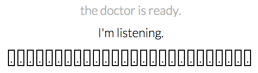

# psychologist

Have a hopeless, anti-directional conversation with a rogerian psychologist bot from 1966. 
As you type into the textbox, your keypresses are visualized.
When you press enter, the bot responds. Its keypresses are visualized as well.

Bot built with Norbert Landsteiner's [javascript implementation](http://www.masswerk.at/elizabot/) of Joseph Weizenbaum's [ELIZA](http://en.wikipedia.org/wiki/ELIZA)

Music by [Alphabets](https://soundcloud.com/asdfghjkljhgfds)

[Demo](http://fuckafucka.com/psychologist/)

